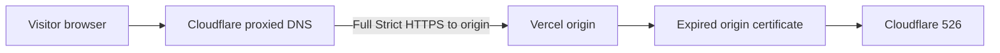
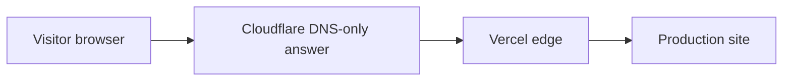

# Incident Postmortem: Cloudflare 526 / Vercel Certificate Renewal

Date prepared: 2026-05-07

Site: `https://exquisitedentistryla.com`

## Executive summary

The production outage was caused by an expired Vercel-origin SSL certificate being served behind Cloudflare while Cloudflare was configured in `Full (Strict)` SSL mode. In `Full (Strict)`, Cloudflare validates the certificate presented by the origin. Once the Vercel certificate expired, Cloudflare could no longer validate the origin connection and returned `526 Invalid SSL certificate` to visitors.

Switching Cloudflare from `Full (Strict)` to `Full` worked as a temporary mitigation because it stopped Cloudflare from enforcing origin certificate validity. The durable fix was to remove Cloudflare proxying from the Vercel-hosted web records, issue fresh Vercel certificates, configure `www` as a Vercel 308 redirect to the apex domain, update DNS to Vercel's current recommended records, and restore Cloudflare SSL mode to `strict`.

## Current state

As of 2026-05-07 10:59 PDT:

- `https://exquisitedentistryla.com/` returns `HTTP/2 200` from Vercel.
- `https://www.exquisitedentistryla.com/` redirects to `https://exquisitedentistryla.com/`.
- The Vercel certificate for `exquisitedentistryla.com` is valid from 2026-05-07 15:56:46 UTC through 2026-08-05 15:56:45 UTC and covers both apex and `www`.
- The Vercel certificate for `www.exquisitedentistryla.com` is valid from 2026-05-07 15:58:03 UTC through 2026-08-05 15:58:02 UTC.
- Cloudflare DNS web records are DNS-only:
  - `A exquisitedentistryla.com -> 216.150.1.1`
  - `A exquisitedentistryla.com -> 216.150.16.1`
  - `CNAME www.exquisitedentistryla.com -> 5af90ad8a79c4de1.vercel-dns-017.com`
- Cloudflare zone SSL mode is back to `strict`.
- Repo production verification passes locally with the strengthened DNS/certificate checks: `13 passed, 0 failed`.
- GitHub Actions rerun of the monitor after repair passed before the monitor hardening change: `9 passed, 0 failed`.

## Impact

Visitors to apex production pages received Cloudflare `526 Invalid SSL certificate` responses. The scheduled production monitor shows the apex site failing by 2026-05-04 10:52 UTC. The last successful scheduled monitor before the failures was 2026-05-03 09:56 UTC.

The strongest evidence indicates the outage window began after the old Vercel certificate expired on 2026-05-03 at roughly 15:47 UTC and before the first failing scheduled monitor on 2026-05-04 at 10:52 UTC.

## Timeline

All times are absolute. PDT is UTC-7.

| Time | Event |
| --- | --- |
| 2026-05-03 09:56 UTC / 02:56 PDT | GitHub scheduled `verify-prod` passed. |
| 2026-05-03 ~15:47 UTC / ~08:47 PDT | Previously observed Vercel-origin certificates for apex and `www` expired. |
| 2026-05-04 10:52 UTC / 03:52 PDT | First scheduled `verify-prod` failure: apex returned `526`, `www` redirect still passed. |
| 2026-05-05 10:26 UTC / 03:26 PDT | Scheduled `verify-prod` failed again with the same pattern. |
| 2026-05-06 10:52 UTC / 03:52 PDT | Scheduled `verify-prod` failed again with the same pattern. |
| 2026-05-06 17:27 PDT | Client emailed asking about `526 Invalid SSL certificate`. |
| 2026-05-06 19:51 PDT and 20:04 PDT | Google Search Console sent `Server error (5xx)` indexing notifications. |
| 2026-05-07 03:57 PDT | Gmail received GitHub notification for failed `verify-prod`. |
| 2026-05-07 morning PDT | Temporary mitigation: Cloudflare changed from `Full (Strict)` to `Full`. |
| 2026-05-07 morning PDT | Durable repair: web DNS records moved to DNS-only, Vercel certificates reissued, `www` set as 308 redirect to apex, Cloudflare SSL restored to `strict`. |
| 2026-05-07 10:58 PDT | Rerun of failed GitHub `verify-prod` passed: `9 passed, 0 failed`. |

## Root cause

The direct root cause was an expired Vercel SSL certificate on the origin path used by Cloudflare while Cloudflare was proxying the domain and enforcing `Full (Strict)` origin validation.

The system path at failure time was:



That explains the exact symptom:

- Cloudflare accepted the visitor connection at the edge.
- Cloudflare then connected to Vercel as the origin.
- The certificate presented by the origin path was expired.
- `Full (Strict)` requires a valid, unexpired, trusted origin certificate matching the requested hostname.
- Cloudflare returned `526`.

## Why switching to Full fixed it temporarily

`Full` still encrypts the Cloudflare-to-origin connection, but it does not enforce the same origin certificate validation as `Full (Strict)`. That allowed Cloudflare to connect to Vercel despite the bad origin certificate. It was a valid emergency mitigation, but not the correct long-term posture because it hides origin certificate failures instead of fixing them.

## Contributing factors

1. Cloudflare was proxying a Vercel-hosted site.
   Vercel's own guidance says stacking an external reverse proxy in front of Vercel is possible but not recommended because Vercel loses full traffic visibility and platform security products lose signal.

2. Vercel certificate renewal failed without an effective operational alert.
   Vercel exposed the issue in the dashboard as `Failed To Renew Cert`, and Vercel supports certificate renewal failure webhook events, but no actioning path was in place.

3. The existing production monitor detected the outage, but it did not escalate loudly enough.
   `verify-prod` failed on May 4, May 5, May 6, and May 7, but the first human/client escalation found in email was May 6 at 17:27 PDT.

4. Cloudflare/Vercel had a double-edge TLS setup.
   The visitor saw Cloudflare, but Cloudflare's origin was Vercel. This creates two TLS layers and makes origin certificate renewal/challenge behavior harder to reason about than letting Vercel serve the public domain directly.

5. The web DNS records were previously orange-clouded/proxied.
   With DNS-only records, the browser reaches Vercel directly and receives the Vercel edge certificate. With proxied records, Cloudflare is inserted into the TLS validation path.

## Evidence

GitHub Actions first failing monitor, 2026-05-04 10:52 UTC:

```text
FAIL GET / returns 200 and correct canonical - Expected 200, got 526
PASS www redirects to apex
FAIL sitemap.xml is valid and apex-only - Expected 200, got 526
FAIL Page /veneers/ returns 200 with apex canonical - Expected 200, got 526
Summary: 1 passed, 8 failed.
```

GitHub Actions rerun after repair, 2026-05-07 17:58 UTC:

```text
PASS GET / returns 200 and correct canonical
PASS www redirects to apex
PASS robots.txt references sitemap
PASS sitemap.xml is valid and apex-only
PASS Page /veneers/ returns 200 with apex canonical
PASS Page /invisalign/ returns 200 with apex canonical
PASS Page /emergency-dentist/ returns 200 with apex canonical
PASS Page /blog/ returns 200 with apex canonical
PASS Page /contact/ returns 200 with apex canonical
Summary: 9 passed, 0 failed.
```

Local strengthened monitor after postmortem hardening, 2026-05-07:

```text
PASS apex DNS points directly to Vercel
PASS www DNS points directly to Vercel
PASS exquisitedentistryla.com certificate has at least 30 days remaining
PASS www.exquisitedentistryla.com certificate has at least 30 days remaining
Summary: 13 passed, 0 failed.
```

Cloudflare status after repair:

```text
PASS account token verify
PASS zone lookup
PASS zone read
PASS dns records read
PASS zone dns settings read
PASS ssl mode setting read
```

Browser verification after repair:

```text
Opened https://www.exquisitedentistryla.com/
Final URL: https://exquisitedentistryla.com/
Title: Cosmetic Dentist Los Angeles | Dr. Aguil | Exquisite Dentistry
```

## Decision: DNS-only Vercel records

Recommended steady state for this site:

- Keep Cloudflare as authoritative DNS.
- Keep Vercel-hosted web records DNS-only, not proxied.
- Let Vercel serve the public TLS certificate directly.
- Keep Cloudflare SSL mode at `strict` so accidental future proxying fails closed instead of hiding certificate problems.

This is the simplest durable architecture for a Vercel-hosted marketing site that does not need Cloudflare WAF/CDN features in front of Vercel.



## Preventive actions

Completed during postmortem:

- Added `workflow_dispatch` to `.github/workflows/verify-prod.yml` so humans and agents can manually run the production monitor without rerunning an old scheduled job.
- Strengthened `scripts/verify-prod.mjs` so it checks public DNS direct-to-Vercel records and fails if either production certificate has fewer than 30 days remaining.

High priority:

- Add loud alerting for `verify-prod` failures. GitHub notification email alone was too easy to miss.
- Add a Vercel webhook receiver or automation for `domain.certificate-renew-failed` and `domain.certificate-add-failed`.
- Add a Cloudflare/Vercel domain health script that checks:
  - Cloudflare web records are DNS-only.
  - Cloudflare SSL mode is `strict`.
  - Vercel domain config is not misconfigured.
  - Live apex returns 200.
  - `www` redirects to apex.

Medium priority:

- Review whether stale Cloudflare DNS `NS` records pointing at `ns43.domaincontrol.com` and `ns44.domaincontrol.com` can be removed. Public authoritative nameservers are Cloudflare, so this is cleanup rather than an active outage cause.
- Decide whether Cloudflare DNSSEC should be enabled after confirming registrar DS record handling.
- Update GitHub Actions Node setup before GitHub's Node 20 action deprecation deadlines become a distraction.

Avoid:

- Do not use Cloudflare `Flexible` SSL for this site.
- Do not leave Cloudflare `Full` as the final fix when the real problem is an invalid origin certificate.
- Do not proxy the Vercel app records unless there is a deliberate Cloudflare feature requirement and a monitoring plan for Vercel certificate renewal/challenge behavior.

## Source references

- Cloudflare Error 526: https://developers.cloudflare.com/support/troubleshooting/http-status-codes/cloudflare-5xx-errors/error-526/
- Cloudflare Full Strict mode: https://developers.cloudflare.com/ssl/origin-configuration/ssl-modes/full-strict/
- Cloudflare proxied vs DNS-only DNS records: https://developers.cloudflare.com/dns/proxy-status/
- Vercel guidance on Cloudflare in front of Vercel: https://vercel.com/kb/guide/cloudflare-with-vercel
- Vercel domain config API: https://vercel.com/docs/rest-api/domains/get-a-domain-s-configuration
- Vercel webhook events for certificate renewal failures: https://vercel.com/docs/webhooks/webhooks-api
